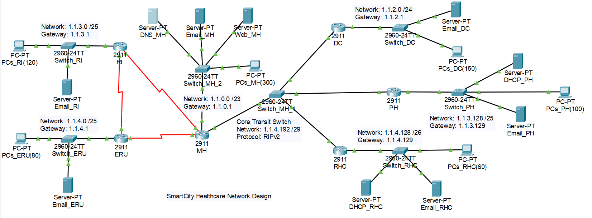

# SmartCity Healthcare Network Design

A Cisco Packet Tracer implementation of an enterprise network for **SmartCity Healthcare**, a
metropolitan healthcare system that links hospitals, clinics, research centers and emergency
units into a single routed infrastructure supporting real-time patient data sharing, secure
internal communication and redundant connectivity.

The project covers VLSM addressing, DHCP, DNS/Web/Email services, mixed static and dynamic
routing, and automatic failover between redundant paths.

---

## Repository Structure

```
SmartCity/
├── README.md
├── diagrams/
│   └── network-topology-1907.png          # Labeled topology diagram
├── docs/
│   └── SmartCity-Healthcare-Network-Design.pdf   # Project requirements brief
└── packet-tracer/
    └── 421_Project_1907.pkt               # Fully configured Packet Tracer simulation
```

---

## Network Topology



Each medical unit is represented by a **Cisco 2911 router** with its own **2960-24TT access
switch**, end devices and servers.

**Main Hospital (MH)** is the central backbone of the network:

- **MH ↔ RI** and **MH ↔ ERU** are direct point-to-point router links.
- **ERU ↔ RI** provides a third link, giving the Emergency Response Unit **dual connectivity**
  and forming a redundant MH–RI–ERU triangle.
- **DC**, **PH** and **RHC** connect to MH through a shared **core transit switch**
  (`1.1.4.192/29`), which then connects to MH.
- A second MH switch hosts the hospital's server farm and end devices.

### Medical Units

| Unit | Code | Devices |
|------|------|---------|
| Main Hospital | MH | 300 |
| Diagnostic Center | DC | 150 |
| Research Institute | RI | 120 |
| Pharmacy Hub | PH | 100 |
| Emergency Response Unit | ERU | 80 |
| Remote Health Clinic | RHC | 60 |

---

## IP Addressing (VLSM)

**Base network: `1.1.0.0/16`**

Subnets are allocated largest-first so that address space is consumed contiguously with no
waste between blocks.

| Unit | Devices | Subnet | Subnet Mask | Gateway | Usable Hosts |
|------|--------:|--------|-------------|---------|-------------:|
| Main Hospital (MH) | 300 | `1.1.0.0/23` | `255.255.254.0` | `1.1.0.1` | 510 |
| Diagnostic Center (DC) | 150 | `1.1.2.0/24` | `255.255.255.0` | `1.1.2.1` | 254 |
| Research Institute (RI) | 120 | `1.1.3.0/25` | `255.255.255.128` | `1.1.3.1` | 126 |
| Pharmacy Hub (PH) | 100 | `1.1.3.128/25` | `255.255.255.128` | `1.1.3.129` | 126 |
| Emergency Response Unit (ERU) | 80 | `1.1.4.0/25` | `255.255.255.128` | `1.1.4.1` | 126 |
| Remote Health Clinic (RHC) | 60 | `1.1.4.128/26` | `255.255.255.192` | `1.1.4.129` | 62 |
| Core transit segment | — | `1.1.4.192/29` | `255.255.255.248` | — | 6 |

---

## IP Assignment Strategy

Address assignment differs per unit to demonstrate three distinct approaches:

| Unit | Method | Details |
|------|--------|---------|
| MH, RI | **Static** | All hosts and servers manually addressed |
| DC, ERU | **Router-based DHCP** | The unit's 2911 router acts as the DHCP server |
| PH, RHC | **Dedicated DHCP server** | A standalone `DHCP_PH` / `DHCP_RHC` server serves the LAN |

---

## Network Services

### DNS and Web (hosted at Main Hospital)

- **DNS server** — `DNS_MH`, resolving all internal `.local` names
- **Web server** — `Web_MH`, serving `www.smartcityhealth.local`

Every device in every unit can reach the web server by domain name, which validates both
end-to-end routing and DNS resolution across the whole network.

### Email

Each unit runs its own mail server for internal communication:

| Unit | Mail Server | Domain |
|------|-------------|--------|
| Main Hospital | `Email_MH` | `mail.mh.local` |
| Research Institute | `Email_RI` | `mail.ri.local` |
| Diagnostic Center | `Email_DC` | `mail.dc.local` |
| Emergency Response Unit | `Email_ERU` | `mail.eru.local` |
| Pharmacy Hub | `Email_PH` | `mail.ph.local` |
| Remote Health Clinic | `Email_RHC` | `mail.rhc.local` |

Mail flow between **MH and RI** is configured and verified end to end.

---

## Routing Design

The network deliberately combines several routing techniques.

### Static Routing

| Route | Type | Purpose |
|-------|------|---------|
| MH → DC | **Next-hop** static route | Route specified by neighbor IP |
| ERU → MH | **Exit-interface** static route | Route specified by outgoing interface |
| PH → DC | **Recursive** static route via RI | Next hop resolved through a second lookup |
| RHC → MH | **Floating** static route via ERU | Higher administrative distance; backup path only |

### Dynamic Routing

- **RIPv2** runs on **RI, PH, DC and ERU**.
- **MH participates in both** static routing and RIPv2, acting as the bridge between the
  statically routed and dynamically routed portions of the network.

---

## Redundancy and Failover

The design is built to survive individual link failures without manual intervention:

- **MH ↔ RI link failure** — traffic automatically reroutes through **ERU** via RIPv2, using
  the third leg of the MH–RI–ERU triangle.
- **Remote Health Clinic (RHC)** — maintains a **primary path via PH** (learned through RIPv2)
  and a **backup path via ERU** (floating static route). The floating route's higher
  administrative distance keeps it out of the routing table until the primary path drops.
- **Pharmacy Hub (PH)** — falls back to the **recursive static route via RI** when its primary
  path fails.

---

## Opening the Project

1. Install **Cisco Packet Tracer 8.x** or later.
2. Open [`packet-tracer/421_Project_1907.pkt`](packet-tracer/421_Project_1907.pkt).
3. Allow the network to converge (RIPv2 updates settle within roughly 30–60 seconds).

### Suggested Verification

| Test | Expectation |
|------|-------------|
| Ping across units | Any PC can reach any other unit's PC |
| Browse `www.smartcityhealth.local` | Web page loads from any device (validates DNS + routing) |
| Send mail `mail.mh.local` ↔ `mail.ri.local` | Message delivered successfully |
| `ipconfig` on a DC / ERU / PH / RHC PC | Address leased from the correct DHCP source |
| `show ip route` on each router | Static, RIPv2 and floating routes present as designed |
| Shut the MH–RI link | Traffic reconverges through ERU; connectivity is retained |

---

## Tools

- **Cisco Packet Tracer 8.x** — simulation and configuration
- **Cisco 2911 Integrated Services Routers** — one per medical unit
- **Cisco 2960-24TT Switches** — LAN access and core transit
- **Server-PT / PC-PT** — servers and end devices

---

## Course

Computer Networks (CSE 421) — network design project.
Full requirements are documented in
[`docs/SmartCity-Healthcare-Network-Design.pdf`](docs/SmartCity-Healthcare-Network-Design.pdf).
